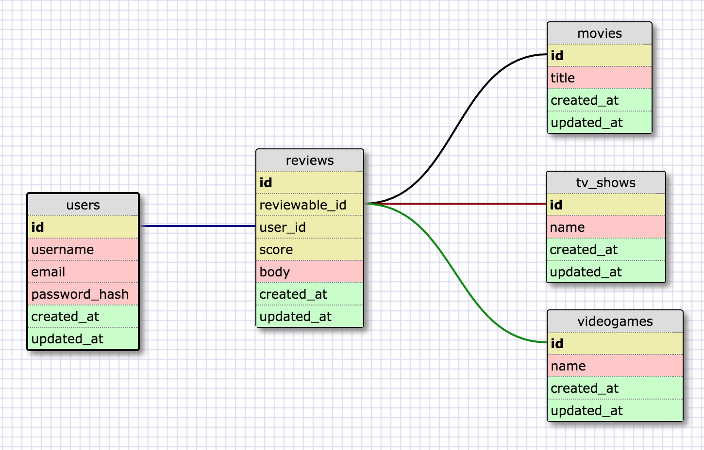

# AR-polymorph

This example project models a review site like Metacritic. Users can write many reviews. Reviews are all the same but can belong to Movies, TV Shows or Videogames. This is the polymorphic relationship. You don't want to have separate MovieReviews, VideogameReviews, etc tables since this will make your db messier and harder to maintain.

**2.9 Polymorphic Associations**

A slightly more advanced twist on associations is the polymorphic association. With polymorphic associations, a model can belong to more than one other model, on a single association. For example, you might have a picture model that belongs to either an employee model or a product model. *More here:*

http://guides.rubyonrails.org/association_basics.html#polymorphic-associations
